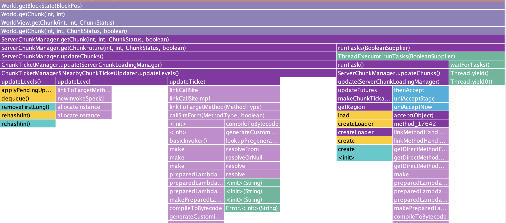

The standard way to read data about a block in MineCraft v1.21.4 Fabric is to
use the following code:

```
World world; // The MineCraft world
int x, y, z; // The block you're interested in

BlockPos blockPos = new BlockPos(x, y, z);
BlockState state = world.getBlockState(blockPos);

// Is Solid:
state.isSolidBlock(world, blockPos);

// Is Liquid:
!state.getFluidState().isEmpty();

// Is Climbable:
state.isIn(BlockTags.CLIMBABLE);

// Redstone Power:
world.getReceivedStrongRedstonePower(blockPos);

// Orientation:
state.get(Properties.FACING);

// etc...
```

This __works__, the problem is that **it's slow**.

To benchmark how slow, I ran a script that read 100 blocks randomly within a
5 chunk radius of the player and averaged the time to read. Running this on my
M1 16-inch 2021 Macbook Pro, it takes around 3000000 nanoseconds __per block__!

That's 3 milliseconds to read the data from a single block. Imagine trying to
scan the entire world to find diamonds, or reading multiple blocks in order to
calculate a path from A to B.

## Why is it slow?



The reason it's slow is that the code above is doing a lot of work. Let's dive
into some of the things that are going on:

 * We allocate a new `BlockPos` on the heap, waiting for the OS to find
   avaialble memory.
 * We check if the provided BlockPos is outside of the world's height limit.
    * This reads the `bottomY` (direct variable access, fairly fast)
    * And *computes* the `topY` (requires one addition and one subtraction)
 * We determine which chunk the block is in
    * This is *fairly* fast, but still requires more math: a bit shift and a
      "floor" operation, which is another comparison
    * This bit shift + "floor" operation is done for X __and__ Z coordinates
 * We check if the current thread is the "server" thread. If not, we queue up
   the chunk load to be processed by the server thread
 * We initialize a Profiler to measure how long chunk loading takes
 * We combine the X and Z coordinates into a single 8-byte long integer with
   more bit shifting and masking
 * We check the last 4 loaded chunks to see if one of these is the one being
   accessed. If it is, we return the chunk from cache
    * **This turns out to be a huge time saver later. See below**
 * We allocate a new `ChunkPos` on the heap, waiting one more for available
   memory
 * We determine if the chunk is fully generated or still processing. If still
   processing, we defer reading until it's complete
 * We calculate which Chunk *Section* the block is in
 * We check if the Chunk Section is empty. If so, we return the default
   BlockState for "AIR"
 * We take the last 4 bits of the X, Y, and Z positions (the remainder when
   dividing the positions by 16) to find the relative location within the
   Chunk Section
 * We defer to the "Paletted Container" to read the data in this X, Y, and Z
   position

At this point we still don't have the block data, but our code diverges a bit.
Because a Paletted Container consists of two pieces of information:

 1. The "palette", containing a de-duplicated list of all blocks in the chunk
    section.
 2. The "storage", containing a list of 4,096 indexes into this palette -- one
    for each X, Y, and Z position.

The reason the code diverges is because based on how many unique blocks are in
a chunk section, we will use one of __four__ different palette types, and one
of __two__ different storage types.

**Storage Types:**

 * Empty Storage: returns "0" for all positions. Very fast.
 * Packed Integer Array: this is a bit more complex

So here's how Packed Integer Array works:

Suppose in your 4,096 block chunk section you have 25 __distinct__ blocks. So
most blocks are just air, grass, dirt, stone, etc. but there are a handful of
less common blocks like oak logs, leaves, coal ore, flowers, etc.

All numbers from 0 to 24 can be expressed using 5 bits, so we convert every
block into a 5-bit index.

Next we tightly stuff all of these 5-bit indexes together, cramming 12 blocks
worth of data into a 64-bit (8-byte) long integer. That occupies 60 bits, with
4 bits of wasted space.

We create an array of these 64-bit "packed" integers, large enough to hold all
4,096 blocks in our chunk section. In this case, 4096 / 12 = 341.33 so we need
342 long integers.

Reading a single X, Y, Z value from the Packed Integer Array involves:

 1. Check if the value is within the bounds of the array
 2. Figure out which long integer holds the desired bits
 3. Read that integer from RAM
 4. Mask out the desired bits
 5. Shift those bits into the desired position

**Palette Types:**

 * Singular Palette: contains a single block state. For example, all blocks in
   the chunk section are AIR
    * Just returns the single block state
 * Array Palette: contains an array of block states
    * Once you have the index for a particular block, you simply access that
      index in the array
 * BiMap Palette: contains a bi-directional hash map between integer and block
   states
    * Truthfully I don't know why or when this is preferred by the MineCraft
      engine, but I __do__ know that internally it also uses an array
 * IdList Palette: contains an array of block IDs
    * Again, I don't really know why or when this is preferred

For the most part reading from these palettes always comes down to a simple
array lookup. However the `.get()` method often also checks that the index
requested is within the bounds of the palette.

Now here's where things get particularly bad:

In Java, when a class method is overwritten by a child class, this is known as
*polymorphism*. A call to `palette.get(x, y, z)` **might** dispatch execution to
`SingularPalette.get()`, `ArrayPalette.get()`, `BiMapPalette.get()`, or
`IdListPalette.get()`. We don't know which are compile time, so it has to
determine which method to call at runtime.

The Just-In-Time (JIT) compiler is __really__ good at optimizing and inlining
bytecode for method calls on-the-fly. This means that the first time you call
a function you incur fuction-call overhead (pushing parameters on the stack,
setting a return pointer, moving the instruction pointer, then unwinding the
stack after the function returns) but on *subsequent* calls all of the code of
the method **just works** without this overhead.

The problem is that function inlining only works for monomorphic (one possible
set of instructions) or bimorphic (two possible sets of instructions) methods.
The moment there are three or more possible code paths (known as "megamorphic")
that might need to be inlined, the JIT gives up and always dispatches a function
call.

So while most of what we've done up until now can be optimized to run as fast
as possible, palette lookups are always eating this overhead cost.

## Whew, that's a lot

So now we know why `world.getBlockState()` is slow, but what can we do to speed
it up? Well there's a few tricks we have up our sleeves.

### 1. We only read chunks after generation


During block searches (e.g. "find diamond ores") and pathfinding (e.g. "go to
position 1500, 70, -800") Orebit does not read BlockState data from the world.
Instead, we rely on two separate representations of the world that are optimized
for these two tasks: [Regions](../data_model/regions) and
[NavBlock Grids](../data_model/navblock_grids).

The only time we read BlockState data is when we're building or updating these
two data structures, which we only do *immediately after a chunk has been
generated or modified*. This means that the chunks we're accessing are always
in the "last 4 chunks touched" cache, so we avoid the cost of chunk loading.

To benchmark this performance I updated my code. Instead of reading 100 blocks
randomly within 5 chunks of the player, I read 100 blocks randomly in the last
chunk that was generated. On the same hardware this immediately reduced the time
to read a block to 1700 nanoseconds. That's a __1,846x speedup__!

The lesson is that if you're reading multiple blocks from the same chunk, you
can amortize the cost of chunk loading over all of the blocks read -- making it
essentially zero.

### 2. We can bypass World-level checks


Because we're hooking into chunk generation and updates, we have an instance of
the Chunk already available to us. This means we can skip straight to the last
few steps of reading our data, bypassing things like world height checks, thread
safety checks, and ChunkPos calculation. This is done using code like so:

```
World world; // The world the chunk resides in
Chunk chunk; // The chunk that just loaded
int x, y, z; // The block you're interested in

int minY = world.getBottomY();
int sectionIndex = (y - minY) / 16;
BlockPos blockPos = new BlockPos(x, y, z);
BlockState state = chunkSections[sectionIndex].getBlockState(x & 0x0F, y & 0x0F, z & 0x0F);
state.isSolidBlock(world, blockPos);
```

I updated my code once again and moved it into the `CHUNK_LOAD` callback. With
the latest changes the time to read a single block's data was down to 700
nanoseconds. That's another __2.4x speedup__!

But we can keep going:

### 3. Eliminate memory allocation


Some amount of time is spent allocating memory for the BlockPos object that
we're creating. However reading the actual BlockState doesn't require this
BlockPos any longer now that we're using the ChunkSection API. So why do we
still need it?

It turns out some blocks have behavior that changes at runtime. A good example
of this is the piston arm. The piston arm may be solid, or may not be solid,
depending on whether or not it's moving. In order to know if a __particular__
piston arm is moving, we query the world for the specific piston arm at a
specific location. Our world queries rely on these BlockPos values.

The naive approach here may be to check for these blocks and avoid allocation of
a BlockPos all together, with something like this:

```
BlockState state = ...;
Block block = state.getBlock();

if (block is PistonExtensionBlock) {
    // Assume solid
    return true;
} else {
    // Most blocks "isSolidBlock" methods don't actually read the "world" and
    // "pos" parameters, instead returning static values
    return state.isSolidBlock(null, null);
}
```

Of course we need to extend this to more than just piston arms. The collection
of all blocks that rely on the world and BlockPos to read solidity is:

 * `BlockWithEntity` -- includes piston arms, sculk sensors, and various others
 * `BambooBlock` -- the exact location *within* a block for bamboo is randomized
 * `PointedDripstone` -- same as bamboo

I updated my code to check for these three block types and assume they were
fully solid, eliminating the allocation of a BlockPos in memory. Now the time to
read a single block is **up** to 900 nanoseconds! It's __28.5% slower__, what
gives?

Well it turns out branch prediction is hard. Every time our code hits this block
it has to figure out whether we need to follow the left path or the right path,
and we do this *per block*. So this isn't actually any faster.

Can we do something else, though? Yes, we can! MineCraft provides a
`BlockPos.Mutable` class! Using this we can allocate memory once and re-use it
in our loop:

```
World world;
BlockState state = ...;

BlockPos.Mutable pos = new BlockPos.Mutable(0, 0, 0);

// This time I'm actually showing the loop
for (int i = 0; i < 100; i++) {
    int x = (random x in the chunk);
    int y = (random y in the chunk section);
    int z = (random z in the chunk);
    pos.set(x, y, z);
    sink = state.isSolidBlock(world, pos);
}
```

With this new code avoiding memory allocation *and* branching, we're down to
600 nanoseconds! A __1.17x speedup__!

But... can we do *even better*?

### 4. Avoiding megamorphism


Here is where things start to get really tricky. Remember when I said that
reading a palette was slow due to megamorphism? Well we can fix this!

We can access the "paletted container" of a Chunk Section like so:

```
PalettedContainer<BlockState> container = chunkSection.getBlockStateContainer();
```

This is an object that contains both the storage and palette for the raw block
data. However, this data is private! So we don't normally have access to it.

Through the power of reflection, we can fix this:

```
static {
    try {
        dataField = PalettedContainer.class.getDeclaredField("data");
        dataField.setAccessible(true);

        Class<?> dataClass = Class.forName("net.minecraft.world.chunk.PalettedContainer$Data");
        storageField = dataClass.getDeclaredField("storage");
        storageField.setAccessible(true);
        paletteField = dataClass.getDeclaredField("palette");
        paletteField.setAccessible(true);

        Class<?> arrayPaletteClass = Class.forName("net.minecraft.world.chunk.ArrayPalette");
        arrayField = arrayPaletteClass.getDeclaredField("array");
        arrayField.setAccessible(true);

        Class<?> biMapPaletteClass = Class.forName("net.minecraft.world.chunk.BiMapPalette");
        biMapField = biMapPaletteClass.getDeclaredField("map");
        biMapField.setAccessible(true);

        Class<?> idListPaletteClass = Class.forName("net.minecraft.world.chunk.IdListPalette");
        idListField = idListPaletteClass.getDeclaredField("idList");
        idListField.setAccessible(true);
    } catch (NoSuchFieldException | ClassNotFoundException e) {
        throw new RuntimeException("Failed to initialize reflection fields", e);
    }
}

public void processChunkSection(ChunkSection chunkSection, World world) {
    PalettedContainer<BlockState> container = chunkSection.getBlockStateContainer();
    Object data = dataField.get(container);
    PaletteStorage storage = (PaletteStorage) storageField.get(data);
    Palette<BlockState> palette = (Palette<BlockState>) paletteField.get(data);
}
```

Now that we've hacked our way through Java's internals, we can add different
code based on what type of ChunkSection we're processing:

```
switch (palette) {
    case SingularPalette<BlockState> singularPalette -> {
        // All blocks are the same!
        BlockState everyBlock = singularPalette.get(0);
        for (int i = 0; i < 100; i++) {
            int x = ..., y = ..., z = ...;
            pos.set(x, y, z);
            sink = everyBlock.isSolidBlock(world, pos);
        }
    }
    case ArrayPalette<BlockState> arrayPalette -> {
        Object[] array = (Object[]) arrayField.get(arrayPalette);
        for (int i = 0; i < 100; i++) {
            int x = ..., y = ..., z = ...;
            pos.set(x, y, z);
            BlockState state = (BlockState) array[storage.get(x, y, z)];
            sink = state.isSolidBlock(world, pos);
        }
    }
    case BiMapPalette<BlockState> blockStateBiMapPalette -> {
        Int2ObjectBiMap<BlockState> map = (Int2ObjectBiMap<BlockState>) biMapField.get(blockStateBiMapPalette);
        for (int i = 0; i < 100; i++) {
            int x = ..., y = ..., z = ...;
            pos.set(x, y, z);
            BlockState state = (BlockState) map.get(storage.get(x, y, z));
            sink = state.isSolidBlock(world, pos);
        }
    }
    case IdListPalette<BlockState> idListPalette -> {
        IndexedIterable<BlockState> idList = (IndexedIterable<BlockState>) idListField.get(idListPalette);
        for (int i = 0; i < 100; i++) {
            int x = ..., y = ..., z = ...;
            pos.set(x, y, z);
            BlockState state = (BlockState) idList.get(storage.get(x, y, z));
            sink = state.isSolidBlock(world, pos);
        }
    }
    case null, default -> {
        throw new RuntimeException("Unexpected palette type: " + palette);
    }
}
```

This seems like a lot of code and a lot of overkill, but it gives us two big
wins:

First, we have inlined the calls to `palette.get()`, so we now avoid function
call overhead.

Second, roughly 60% of all ChunkSections in MineCraft contain nothing but air
(ChunkSections above Y = 80). This means that 60% of the time we will hit our
SingularPalette, avoiding far __more__ work.

Benchmarking all cases:

 * When using a SingularPalette, the average time to read a block is down to
   2.5 nanoseconds. A __240x speedup__!
 * When using an ArrayPalette, the average time to read a block is down to 14
   nanoseconds. A __43x speedup__!
 * When using a BiMapPalette, the average time to read a block is down to 27
   nanoseconds. A __22x speedup__!
 * In my testing I didn't see an IdListPalette, so I don't know when these are
   used.

Given that 60% of ChunkSections are using SingularPalette, the average time to
read a block is now:

$60% x 2.5 + 20% x 14 + 20% x 27 = 1.5 + 2.8 + 5.4 = 9.7$ nanoseconds.

This is a __62x speedup__ over the previous best case! But... the question
remains... *can we do better*?

### 5. Limit reflective access


We pay a cost every time we access a field via reflection. Reflection requires
Java to introspect about its own bytecode at runtime, eliminating many potential
gains from the JIT compiler. While we were able to avoid megamorphism, we now
incur the full wrath of unoptimized Java code for every single block we read.

So what can we do? Are we at the end of our optimization journey?

Not by a long shot!

So far we've benchmarked **random** access to blocks in a ChunkSection. But when
we're generating our NavBlock Grid and our Regions, we're going to *scan* the
entire ChunkSection in order. This means that after reading one block, we know
the next block we're going to read is always the next one in sequence.

It just so happens that the `PaletteStorage` abstract class provides us with an
iterator that will loop over all values in the ChunkSection in order. This means
we only have to access the reflected field once, to call `.forEach`. After this,
the iterator handles everything with beautifully optimized code:

```
// This example is just for ArrayPalette, but the same applies to all others
case ArrayPalette<BlockState> arrayPalette -> {
    Object[] array = (Object[]) arrayField.get(palette);
    storage.forEach(index -> {
        int x = ..., y = ..., z = ...;
        pos.set(x, y, z);
        BlockState state = (BlockState) array[index];
        sink = state.isSolidBlock(world, pos);
    });
}
```

We're now no longer benchmarking the average time to read 100 random blocks, but
the average time to read **all** blocks in a ChunkSection. Dividing this by
4,096 gives us the average time per block. So what do our times look like now?

 * SingularPalette: 3.5 nanoseconds
   * In this case the cost of the iterator actually *increases* the time to read
 * ArrayPalette: 10 nanoseconds
 * BiMapPalette: 13 nanoseconds
 * IdListPalette: *no data*

Our average read time per block is now:

$60% x 3.5 + 20% x 10 + 20% x 13 = 2.1 + 2.0 + 2.6 = 6.7$ nanoseconds.

That's a __1.44x speedup__ over the previous. But... *can we do better*?

### 6. Maybe...

PackedIntgerArray already has a very optimal `forEach` method that only loads
each long integer once, then repeatedly shifts off values of the appropriate
size in order to call our method once per value.

Also recall that the JIT already optimizes and inlines functions if they are
either monomorphic or bimorphic. In the case of PaletteStorage, we only have two
subclasses, not four, meaning our method call is bimorphic and the JIT is able
to handle this for us.

But I do have a few ideas...
